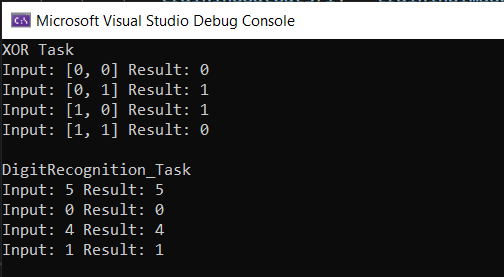

# Neural Network Project

## This is a console project that implements a perceptron for solving tasks such as number recognition and XOR.

### You can fully customize the perceptron to your needs:

#### 1. Change the number of layers and neurons
#### 2. Set any of the available activation functions
#### 3. Save and read the values of weights and biases
#### 4. Train the neural network

```cs
// 1 - 2
NeuralNetwork nn = new NeuralNetwork(new SigmoidActivationFunction(), new uint[] { 2, 2, 1 });
// 3 - 4
nn.Train(trainingInputs, trainingOutputs, epochs);
nn.SaveWeightsAndBiases("DigitRecognition_Task.txt");
nn.LoadWeightsAndBiases("DigitRecognition_Task.txt");
```

### Preview:

